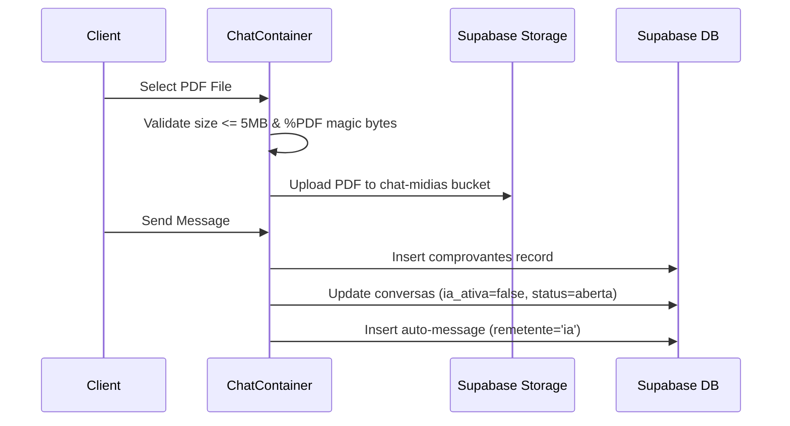

# Design: Dashboard Improvements and PDF Payment Receipt Attachment

## Technical Approach

We will enhance the client navigation using a client-side component (`ClienteNav`) that utilizes the `usePathname()` hook to dynamically style links. We will introduce a client-side operator inactivity monitor (`InactivityLogout`) to automatically log out operators after 15 minutes of idle state. For payment validation, the client chat interface will validate uploaded files to accept only PDFs under 5MB with magic bytes verification. On upload, the chatbot will be deactivated (`ia_ativa = false`), the conversation status marked as `aberta`, and an automated confirmation message inserted. A new database table `comprovantes` will be created with Row Level Security (RLS) policies. Lastly, a "Comprovantes" tab will be added to the operator admin dashboard allowing listing, filtering, and previewing receipt PDFs via signed URLs.

## Architecture Decisions

| Decision | Option | Tradeoff | Choice & Rationale |
|---|---|---|---|
| **Client Navigation State** | Next.js `usePathname()` hook in client component. | Moves state checking to client-side, decoupling it from server headers. | **Choice**: `ClienteNav` component.<br>**Rationale**: Prevents full page reloads and avoids relying on `x-pathname` header middleware. |
| **Inactivity Logout** | Client-side wrapper listening to interaction events. | Relies on client-side JS events (`mousemove`, `mousedown`, etc.). | **Choice**: `InactivityLogout` wrapper in operator layout.<br>**Rationale**: Standard client inactivity monitoring. Logs out via Supabase auth and redirects to `/login`. |
| **PDF Signature Check** | Magic bytes validation using `FileReader` API. | Requires loading file header array buffer in memory. | **Choice**: Magic byte verification (`%PDF-`).<br>**Rationale**: Prevents users from renaming malicious/invalid files to `.pdf` extension. |
| **Sofia Chat Handoff** | Disable AI and mark conversation as open. | Handover is immediate and requires human operator action. | **Choice**: Set `ia_ativa = false` and `status = 'aberta'`. Insert automated "ia" response.<br>**Rationale**: Customer receipts must be manually approved by operators, stopping AI interference. |

## Data Flow

### PDF Receipt Upload and Sofia Handoff
1. Client selects PDF → magic bytes & size validated.
2. File uploaded to `chat-midias` storage bucket.
3. Message sent → `comprovantes` entry saved, `conversas` updated (`ia_ativa = false`, `status = 'aberta'`), and automated IA message inserted.



## File Changes

| File | Action | Description |
|------|--------|-------------|
| `supabase/migrations/20260711155000_comprovantes_pdf.sql` | Create | Database schema and RLS policies for `comprovantes` table. |
| `src/components/cliente/ClienteNav.tsx` | Create | Client-side navigation tab component using `usePathname`. |
| `src/app/cliente/layout.tsx` | Modify | Render `ClienteNav`, remove `x-pathname` parsing, update logout redirect. |
| `src/components/operator/InactivityLogout.tsx` | Create | Client component that monitors operator activity and logs out after 15 minutes. |
| `src/app/atendimento/layout.tsx` | Create | Shared layout wrapping operator routes and mounting `InactivityLogout`. |
| `src/components/chat/ChatContainer.tsx` | Modify | Restrict input to `application/pdf`, validate magic bytes, execute table saves and Sofia handoff logic. |
| `src/app/actions/admin.ts` | Modify | Add `obterComprovantes` server action with filters. |
| `src/components/operator/AdminDashboard.tsx` | Modify | Add `comprovantes` tab, filter panel, table of receipts, and PDF previsualizer. |

## Interfaces / Contracts

```typescript
// Type for comprovantes table structure
interface Comprovante {
  id: string;
  cliente_id: string;
  conversa_id: string | null;
  caminho_arquivo: string;
  nome_arquivo: string;
  tamanho_bytes: number;
  data_criacao: string;
}

// Admin server action filters
interface ComprovanteFilter {
  nomeCliente?: string;
  dataInicio?: string; // ISO format
  dataFim?: string;    // ISO format
}
```

## Testing Strategy

| Layer | What to Test | Approach |
|-------|-------------|----------|
| Unit | `ClienteNav` active state styling | Verify correct Tailwind CSS classes apply based on simulated pathname. |
| Unit | PDF Magic bytes helper | Mock `FileReader` and assert return values for valid/invalid PDFs. |
| Integration | Inactivity Auto-logout | Mock auth signout and verify timer triggers after inactivity window. |
| Integration | Chat handoff flow | Verify database insertions (`comprovantes`, `mensagens`) and state updates when sending PDF. |

## Migration / Rollout

Apply SQL migration `20260711155000_comprovantes_pdf.sql`. Reversion involves running `DROP TABLE public.comprovantes` and restoring layout/chat component code.

## Open Questions

- [ ] Should we also restrict the Supabase storage bucket policies for `chat-midias` to enforce PDF uploads, or is client-side validation sufficient?
- [ ] Is there a naming pattern required for the comprovante files in storage, or is the current timestamped chat attachment folder structure appropriate?
