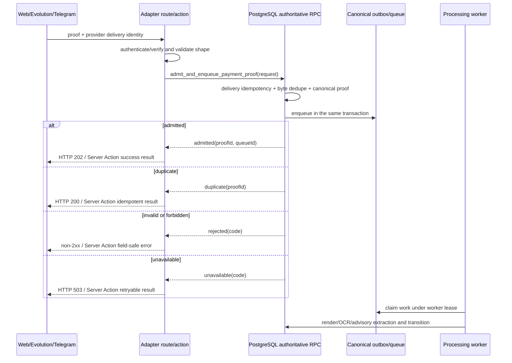
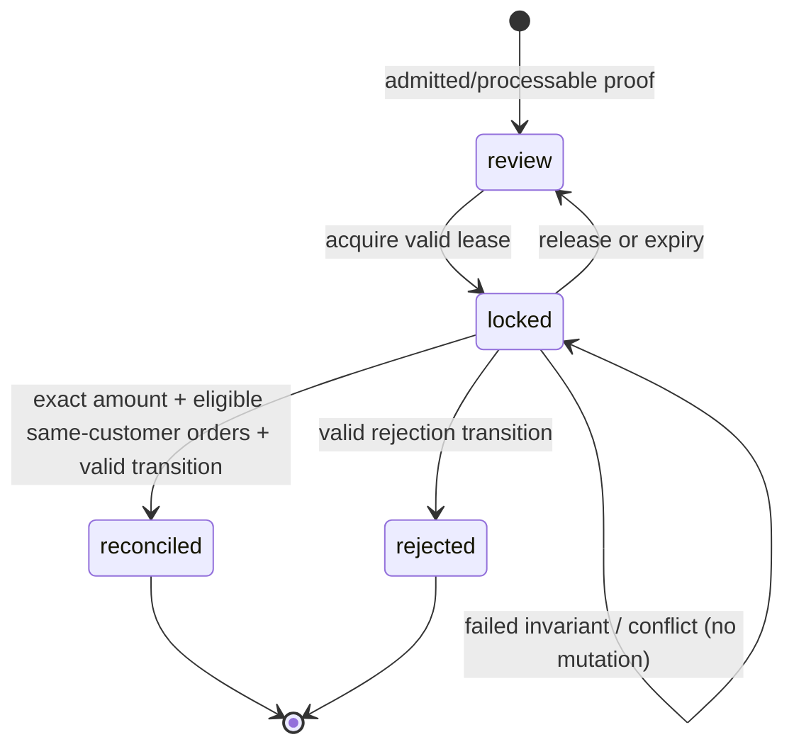

# Canonical Payment Proof Operations — Design

## Decision summary

This design delivers five ordered, independently rollbackable causal units. PostgreSQL remains authoritative for admission, authorization, locks, state transitions, and immutable audit evidence. Web routes and Server Actions are untrusted adapters: they authenticate or verify the caller, validate shape, call the authoritative contract, and translate typed outcomes without duplicating authority. Evolution is the only production WhatsApp payment-proof authority; Cloud remains compatible for verification and general chat but is deliberately non-admitting for payment media. Gates are static, allowlisted environment/Compose inputs, evaluated at Web process start and therefore changed only by controlled Web recreation.

| Decision | Chosen design |
| --- | --- |
| SQL recovery | Diagnose every known failure before changing it; classify behavior-first as RED production defect, GREEN obsolete expectation, or GREEN bootstrap defect. |
| Intake | One atomic `admit_and_enqueue_payment_proof` database API, shared by Web, Evolution, and Telegram. |
| Provider boundary | Evolution only for WhatsApp proof intake; Cloud payment media is authenticated, acknowledged, and non-admitting. |
| Reconciliation | Active sellers may reconcile any eligible customer's proof; DB/RPCs enforce capabilities, exact invariants, lease ownership, and audit. |
| Recovery | Persist unresolved metrics and alert-delivery failures; diagnostics are privileged/read-only; replay is explicit, eligible-state-only, idempotent, locked, and audited. |
| Gates | Compose/environment is the sole authority; only allowlisted values parse; missing, unreadable, malformed, cache-local, and runtime overrides are closed. |
| Production safety | No historic migration edits, no automatic production replay, restore, purge, gate opening, or replacement of the immutable image rollback procedure. |

## Architecture and boundaries



**Security boundaries.** Database migrations/RPCs and RLS are the final authority. Provider adapters verify provider authentication before their business branches. Server Actions re-authenticate, re-authorize, validate untrusted IDs/input, call RPCs, and return a minimal serializable result; rendered controls are convenience only. Workers use dedicated service credentials and leases, never caller credentials. Diagnostic detail is privileged and redacted before leaving the server; external responses never expose tokens, raw payloads, storage URLs, SQL details, or internal error text.

## Contracts and state models

### Canonical intake contract

`admit_and_enqueue_payment_proof` accepts a normalized request with `channel` (`web`, `evolution`, `telegram`), a channel-scoped delivery identity, trusted source metadata, content reference/hash, customer/chat correlation where available, and a request id. It returns one typed outcome:

| Outcome | Persistence invariant | HTTP adapter mapping | Server Action mapping |
| --- | --- | --- | --- |
| `admitted { proofId, queueId }` | Proof admission and exactly one processable queue/outbox record commit together. | `202 Accepted` | `{ ok: true, kind: 'admitted', proofId }`; do not manufacture HTTP semantics. |
| `duplicate { proofId }` | Existing delivery/idempotency record is reused; no proof, queue, chat projection, or notification is added. | `200 OK` | `{ ok: true, kind: 'duplicate', proofId }` |
| `rejected { code }` | No proof or queue record commits. | applicable non-2xx | `{ ok: false, kind: 'rejected', code }` |
| `unavailable { code }` | Transaction rolls back; specifically no admitted-but-unenqueued state exists. | `503 Service Unavailable` | `{ ok: false, kind: 'unavailable', retryable: true, code }` |

Delivery idempotency is namespaced as `web:<authenticated-submitter-or-upload-session>:<client-request-id>`, `evolution:<instance-or-phone>:<provider-message-id>`, and `telegram:<bot-or-chat>:<update-or-message-id>`. It is not a cross-provider key. Global exact-byte deduplication uses the canonical content digest/tombstone independently of delivery namespace. The RPC is transactional: its unique delivery record, canonical record/dedupe lookup, and queue/outbox insertion succeed together or roll back together.

Cloud POST first authenticates. Authenticated payment-media events are classified `ignored_payment_media`, return `200`, and write no canonical proof, queue work, or legacy `comprovantes` record. GET challenge and authenticated non-payment general chat retain their present behavior. Evolution has no legacy-insert fallback; a failure maps to the typed unavailable/rejected outcome, never to `comprovantes`.

### Reconciliation, lock, and audit model

Capabilities are database-authoritative: active `vendedor`, `supervisor`, and `admin` may confirm amount, link eligible orders, reconcile/approve, and reject; every active seller has customer-wide scope. Only active supervisor/admin may restore, purge, inspect dead letters, or mutate replay. An inactive account or other role is denied even if UI state is stale.

A lock acquisition RPC creates or renews a proof-scoped lease with an opaque lock token, holder actor ID, and expiry. Subsequent reconciliation/rejection RPCs require the token and atomically verify current holder and unexpired lease. Tokens are never trusted solely from client state and are not placed in audit as credentials. A competing active lease yields `lock_conflict`; an expired token yields `lock_expired`; only expiry permits a new acquisition. Release may be explicit or lease expiry; no lock stealing.



In one transaction, reconciliation validates: actor capability and active status; valid source proof state; current lock ownership and expiry; exact confirmed amount equals the aggregate accepted payment/order amount; every linked order belongs to the proof customer; every order is in an eligible pending state; no order/link is already consumed incompatibly; and the transition is valid/idempotent. Failure changes neither proof, payment, order, linkage, nor audit success outcome. Repeating the same completed request returns the established idempotent outcome; conflicting repeated input is rejected.

Each attempted privileged or seller reconciliation operation appends an immutable event carrying actor ID, actor-role snapshot obtained in the same authorized transaction, timestamp, action, proof/customer/order references, request/idempotency reference, and success/rejection transition outcome. Historic roles are event columns, never derived from mutable profiles.

Atendimento is the operational topology: the payment-proof workflow must surface status, amount confirmation, eligible same-customer orders, lock holder/lease status, and actionable safe feedback for sellers; it must make unavailable privileged recovery actions absent or explicitly forbidden. The admin panel alone is insufficient. Server Actions independently repeat session, role, active-state, input, and RPC-outcome checks and revalidate/refresh only after successful mutations.

### Observability and replay

Persist a dead-letter aggregate/read model or queryable durable records for `unresolved_count` and `oldest_unresolved_at`; expose calculated oldest age in diagnostics. Preserve an alert-delivery attempt/failure record containing correlation ID, destination class, sanitized error class, attempts, timestamps, and terminal status—never secret payloads or Telegram credentials. Alert failures must not recursively create payment-proof admin alerts: they use a separate bounded failure ledger with dedupe key/cooldown and no alert-on-alert worker. A diagnostic health signal can report pending/terminal alert-delivery failure counts without dispatching a new alert from each failed attempt.

Diagnostics perform dry reads only: no lease claim, retry increment, replay enqueue, or state transition occurs on inspection. Supervisor/admin authorization is checked in RPC and action. Replay accepts a privileged actor, target ID, explicit operation type, and replay idempotency key. In a single transaction it records the request, checks authorization, gate/operational eligibility, nonterminal state, no active lock, and replay-key uniqueness, then creates at most one new work item/transition and writes outcome audit. Terminal, locked, duplicate, and otherwise ineligible requests are recorded as rejected outcomes without target mutation. Deployment, alerting, and scheduled retry do not invoke replay in production.

### Gate contract

Define a small named allowlist in Compose/env (for example canonical intake, processing, seller reconciliation, privileged replay, and cleanup), with documented closed/open literals only. The shared parser accepts exactly those literals, returns `{ effective: 'closed'|'open', reason: 'configured'|'missing'|'invalid'|'unreadable' }`, and defaults closed. It reads process environment only; cache-local paths, dynamic runtime overrides, database toggles, and unallowlisted names have no precedence or ability to open capability.

The Web process captures effective values at startup. Diagnostics disclose gate names, effective state, and non-secret reason, never raw environment values or secrets. Changing Compose/env alone does not change an already running process; operations close/open declaratively and perform controlled Web-only recreation. Existing immutable image rollback remains the rollback for code/image defects and is not replaced by gate rollback.

## Phase plan, migration order, and compatibility

| Phase | Work and migration posture | Compatibility / rollback |
| --- | --- | --- |
| 1. SQL baseline | Reproduce each of the 11 assertions and the blocked suite individually; record observed invariant, fixture/setup, current RPC signature/state, and classification. Correct only forward with a new migration if an active production RPC is defective; never edit old production migration history. Make test bootstrap idempotent with guarded setup rather than replaying non-idempotent migrations. | No intake/authority exposure. Revert isolated harness/new forward correction if required, retaining diagnosis evidence. |
| 2. Admission authority | Add/validate atomic RPC contract before switching adapters; migrate any required constraints/outbox semantics forward; update Web/Evolution/Telegram adapters and worker tests; remove Evolution legacy insert. Cloud branch preserves handshake/chat. | Canonical records remain compatible. Roll back adapter deployment as one unit only; never reintroduce legacy insert as rollback. |
| 3. Reconciliation | Add forward schema/RPC changes for lease, immutable event snapshots, capabilities, and exact transition enforcement before UI/action exposure. Build Atendimento workflow after authoritative tests are green. | Roll back UI/action exposure together; audit evidence is append-only and retained. |
| 4. Operations | Add durable alert-failure/audit/replay records and restricted RPCs before diagnostics/actions. Keep replay gate closed by default. | Disable recovery interface/policy without deleting evidence or changing live intake. |
| 5. Gates/rollout | Introduce parser and Compose/env declarations; remove cache override dependency only after equivalent closed behavior is verified. Diagnostics reports startup-effective values. | Close desired gate and recreate Web; immutable image rollback stays available for defects. |

Backward compatibility is intentionally narrow: existing canonical proofs, events, queue records, and Cloud handshake/general chat continue. Legacy `comprovantes` is not a compatibility target for newly received Evolution proof media. Migrations are additive/forward-only with backfill only when independently proven safe; no destructive historic rewrite, automatic data cleanup, or production data mutation is part of delivery.

## Verification and TDD evidence matrix

Phase work follows RED → smallest GREEN correction → triangulation/refactor. Each RED case names an invariant, captures command/output and candidate identity, and stays with the implementation work unit.

| Unit | RED evidence and candidate verification | GREEN/negative controls |
| --- | --- | --- |
| 1 | Run each six operational-metrics, four admin-alert, and one queue-budget assertion plus `security_handoff_receipts.sql`; classify production defect vs obsolete expectation vs bootstrap failure before edits. | Full affected pgTAP suite is green; repeat bootstrap against prepared DB; assert actual TAP statements run. |
| 2 | Route/integration tests for successful, duplicate, invalid, and enqueue-failing Web/Evolution/Telegram deliveries, with spies proving no inline render/OCR/extraction. | Assert transaction rollback on enqueue failure, unique namespace behavior, exact-byte dedupe, worker claim execution, no Evolution legacy insert, Cloud media `200` with no proof/work, valid Cloud GET/chat preserved. |
| 3 | RPC concurrency tests using two actors/tokens and transition/invariant matrices; action/component tests model stale/unauthorized clients. | Active unassigned seller succeeds; inactive/unauthorized sellers fail; supervisor/admin exceptional controls remain; foreign customer, ineligible order, amount mismatch, expiry, conflict, and invalid state leave no partial mutations; role snapshot remains after role change. |
| 4 | Database and integration tests simulate unresolved dead letters and alert transport failure; prove diagnostic path cannot mutate. | Persisted count/oldest age/failure history; no recursive alert enqueue; seller denied inspection/replay; replay duplicate yields one work item, terminal/locked cases unchanged, dry reads unchanged, audit complete. |
| 5 | Parser table tests for every open literal and missing/malformed/unreadable/cache/runtime value; process-start behavior test. | Effective diagnostics redacted; env change is inert before recreation and effective after controlled recreation; deployment test proves no automatic opening/replay. |

Before implementation, read the repository-installed Next.js 16 documents required by `AGENTS.md`: `node_modules/next/dist/docs/01-app/02-guides/server-actions.md`, `01-app/03-api-reference/05-config/01-next-config-js/serverActions.md`, `01-app/01-getting-started/15-route-handlers.md`, and `01-app/03-api-reference/03-file-conventions/route.md`. The implementation must follow their current guidance: Server Actions are public POST entry points requiring application authorization/input validation and return serialized action results rather than webhook statuses; Route Handlers use Web Request/Response semantics and POST is noncached by default; proxy origins/body limits require current `serverActions` configuration verification.

## Rollout runbook and non-actions

| Stage | Entry evidence | Authorized action and observation | Stop condition / rollback |
| --- | --- | --- | --- |
| 0: closed baseline | Phase 1 full green suite and deployed image verified. | Keep all protected gates closed; observe test/worker health only. | Any baseline regression: stop subsequent phases; immutable-image rollback if code defect. |
| 1: intake | Atomic admission, provider contract, queue worker, duplicate tests, and metrics verified. | Separately authorize intake gate; recreate Web; observe admission success/503s, queue latency, duplicate suppression, Cloud non-admission. | Unexpected loss/duplication, queue backlog, or handshake/chat regression: close intake gate, recreate Web. |
| 2: processing | Stable intake and worker/dead-letter signals. | Separately authorize processing behavior; recreate Web; observe leases, processing latency, failures. | Lease churn, growing dead letters, or invariant breach: close applicable gate, recreate Web. |
| 3: reconciliation | Seller authorization, lock, audit, and Atendimento evidence green. | Separately authorize seller gate; recreate Web; observe action denials, lock conflicts, reconciliation outcomes. | Unauthorized acceptance, partial mutation, or abnormal conflicts: close seller gate, recreate Web. |
| 4: recovery readiness | Persistent diagnostics/replay eligibility and audit tests green. | Keep replay closed unless separately authorized for a named operational incident; inspect read-only diagnostics. | Any recovery invariant/alert storm: close replay gate, recreate Web; do not auto-replay. |

Implementation and deployment do **not** open a production gate, replay a production dead letter, restore/purge production proofs, weaken a failing assertion, alter old production migration history, expose secrets, or alter the existing immutable-image rollback procedure.

## Alternatives rejected

| Alternative | Rejection rationale |
| --- | --- |
| Database settings/KV/dynamic gate service | Confirmed product choice is declarative Compose/environment; dynamic controls enlarge authority and violate static adoption requirements. |
| Cloud as second WhatsApp proof provider | Violates Evolution-exclusive authority and duplicates intake/deduplication risk. |
| Synchronous webhook rendering/OCR | Couples acknowledgement latency and availability to expensive processing. |
| Legacy `comprovantes` fallback | Creates an unaudited bypass outside canonical ledger, dedupe, and queue invariants. |
| Role-array-only seller expansion | Client/action guards cannot protect direct requests or concurrent database mutation. |
| Automatic replay or alert-on-alert recursion | Risks duplicate work and recursive operational storms. |
| Editing historic migrations | Breaks production migration history; diagnosed corrections must be forward-only. |

## RDD causal chain and review boundaries

RDD is enabled. Before each implementation candidate: confirm the approved issue (`status:approved`), a clean-current-main reproduction, and no superseding/conflicting PR; bind candidate ID, exact commands, scenario, result, negative controls, and independent read-only validation. The exact chain strategy remains deferred under `ask-on-risk`, but the forecast exceeds 400 total lines, so each causal unit is a required candidate-sized PR/work unit. If any candidate forecast exceeds 400 additions plus deletions, slice it further or request maintainer direction before edits.

```text
Issue/PR 1 SQL baseline
  -> Issue/PR 2 canonical intake authority
    -> Issue/PR 3 seller reconciliation
      -> Issue/PR 4 observability and replay
        -> Issue/PR 5 declarative gates and rollout
```

| Candidate work unit (≤400 authored lines) | Causal invariant / rollback | Candidate-specific verification |
| --- | --- | --- |
| 1a bootstrap + expectation corrections; 1b only if a diagnosed forward RPC correction exceeds budget | Green evidence means the suite tests real behavior and setup repeats safely. | Assertion-by-assertion classification log, full pgTAP rerun, repeated bootstrap, independent read-only validation. |
| 2a atomic intake/RPC tests; 2b route/provider adapters if needed | Every acknowledged proof is canonical and enqueued, with Evolution exclusive. | Transactional failure test, provider matrix, fast-ack timing/spies, worker test, Cloud handshake/chat regressions. |
| 3a DB locks/capabilities/audit; 3b actions/Atendimento | Authorized seller mutation is exact, serializable, and auditable. | SQL concurrency matrix first; then action/UI success and negative controls under a fresh candidate. |
| 4a persistence/diagnostic RPCs; 4b privileged UI/actions | Recovery is observable and explicit without automatic mutation. | Dry-read proof, alert-storm negative test, replay idempotency/terminal/lock matrix, role/audit tests. |
| 5a parser/Compose declaration; 5b diagnostics/runbook tests/docs | Only recreated deployment configuration can open a gate. | Parser truth table, no-cache override test, process-start/recreation test, rollout stop/rollback review. |

Each unit includes its tests and user/operator documentation, has one conventional outcome-focused commit, and names start state, dependency, end state, rollback, and follow-up. This is a planning artifact only; no RDD receipt, approval, production operation, or implementation candidate has been created by this design.
