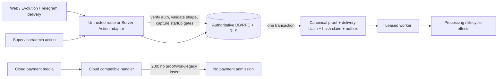

# Complete Multichannel Payment-Proof Rollout — Design

## Status, scope, and governing decisions

This is an operations-completion design for the already verified canonical payment-proof implementation. It does not redesign intake, reopen the historical strict-TDD provenance disposition, modify historical OpenSpec artifacts, or authorize live operations. Product changes are limited to the reconciliation authority correction and Telegram gate support required by this change. All other work is runbook, verification, evidence, and release preparation.

The historical `canonical-payment-proof-operations` design is context only. Its seller-capable reconciliation decision is superseded: **only an active `supervisor` or `admin` may confirm/correct amount, link eligible orders, reconcile/approve, or reject.** An active, inactive, or stale-session `vendedor` is denied at every layer and cannot cause protected state or a success audit event.

Operational authority remains deliberately split:

- A named authorized operator may approve a bounded canary and the relevant gate change.
- A named administrator may perform the restore operation inside that approved window; a named supervisor/admin may perform other separately authorized privileged operations such as replay.
- A named accountable human must decide whether each capability remains closed, becomes time-bounded, or becomes ongoing.
- After implementation and pre-deployment verification are complete, the owner has authorized one controlled final production deployment/test using an immutable candidate, health gates, circuit breaker, and rollback.
- Evidence acceptance authorizes push and PR opening only at the final release phase.
- Merge requires a separate final, explicit authorization that identifies the PR or commit.

No deployment, test suite, alert, scheduled job, code delivery, or canary completion may open gates, restore/purge, replay, clean up, or create permanent enablement automatically.

## Proven baseline and architecture boundaries

The proven production baseline has canonical intake open and processing, reconciliation, cleanup, privileged replay, and WhatsApp intake closed. Missing or invalid values still default closed, and PostgreSQL remains the authority for canonical admission. Web, Evolution, and Telegram normalize input and call one transactional PostgreSQL admission boundary; the worker performs expensive processing asynchronously. Evolution is the exclusive production WhatsApp proof-media authority. WhatsApp Cloud continues its verification handshake and required non-payment general-chat behavior, but authenticated Cloud payment media is acknowledged as compatible non-admitting traffic and creates neither canonical work nor a legacy `comprovantes` write.

Previously completed **Web and Telegram canaries are baseline handoff evidence only**. They must be recorded in sanitized form and must not be rerun in this rollout. They neither leave a gate open nor authorize permanent processing, reconciliation, lifecycle operations, or replay.



### Authority and data-flow contract

| Boundary | Responsibility | Must not do |
| --- | --- | --- |
| Compose/deployment configuration | Supply allowlisted literals to the Web workload before startup. | Dynamically toggle a running process, use DB/cache/runtime overrides, or expose raw values. |
| Web startup gate parser | Capture immutable effective gate state and sanitized reason for the process lifetime. | Re-read changed environment or allow a malformed/missing value to open a capability. |
| Web/Evolution/Telegram adapters | Authenticate source, validate bounded PDF/identity fields, select channel delivery namespace, invoke typed RPC, return safe acknowledgement/result. | Render, OCR, extract, write legacy proofs, decide financial authorization, or bypass canonical admission. |
| Database/RPC/RLS | Atomically enforce admission/dedupe, role/activity checks, valid transitions, idempotency, leases/fences, and immutable audit. | Trust client role/UI state or derive historical role from a mutable profile. |
| Worker/outbox | Claim and perform canonical work under a bounded lease/fence and retry policy. | Execute unfenced concurrent effects, resurrect purged bytes, or automatically replay dead letters. |
| Server Actions/UI | Reauthenticate, validate untrusted input, invoke authorized RPCs, map typed outcomes to safe feedback, and hide/disable unauthorized controls. The restore startup gate controls this Web action boundary only. | Treat UI visibility as authority, claim the startup gate enforces direct SQL/RPC calls, or return raw database/provider errors. |
| Diagnostics/runbook | Expose privileged read-only, redacted state and evidence references. | Mutate target state or disclose customer/provider secrets or full identifiers. |

The canonical admission RPC preserves the established typed outcomes: `admitted`, `duplicate`, `rejected`, and `unavailable`. Admission commits the scoped provider-delivery claim, global byte-hash claim, canonical record, and exactly one processable outbox/queue record in one transaction; a queue failure rolls all of them back. Provider delivery keys are channel-scoped, while SHA-256 dedupe is global across customers, channels, states, races, and retained tombstones.

## Reconciliation authority transition

The authority correction is a dependency for every operational phase. It must be delivered from the database outward, never as a UI-only restriction.

1. **Database/RPC/RLS first.** Replace the historical seller-capable predicate for amount confirmation, eligible-order linking, reconciliation/approval, and rejection with `active supervisor OR active admin`. The successful transaction snapshots immutable actor ID and role-at-action-time. A denied exception rolls back every write in that transaction, including any attempted audit write; durable denied-attempt telemetry, if later required, MUST use a separately designed boundary rather than pretending an exception-path insert can commit. The RPC validates lock holder/expiry, source state, eligible same-customer pending orders, exact-cent equality, and idempotent completion before protected writes.
2. **Actions second.** Server Actions reauthenticate and obtain current session/activity state, validate IDs and payload shape, call the RPC, translate typed denials to a stable safe result, and revalidate only after successful mutation. Direct, stale, or forged seller submissions remain denied by the RPC.
3. **UI third.** Atendimento and any administrative/payment-proof surfaces show reconciliation controls only to active supervisors/admins. Sellers can receive any separately authorized read-only status, but cannot obtain confirmation, linking, approve, reject, restore, purge, diagnostic, or replay affordances. UI feedback must not reveal SQL, provider, order, or lock internals.
4. **Audit verification.** Audit rows for committed permitted operations retain actor identity, role snapshot, action, request/idempotency reference, target aliases/references held in restricted storage, and outcome. A later role/profile change cannot rewrite the event meaning. Denials produce no protected mutation or success audit event; authorization evidence comes from deterministic negative tests and sanitized operational telemetry unless a separate durable denial ledger is explicitly designed later.

A rejected seller request changes no proof, order, payment, linkage, queue, notification, lock, or success-audit state. Unsupported, inactive, and stale-session actors receive the same safe denial class.

## Gate model, configuration hygiene, and deployment safety

All gates use a small documented allowlist of declarative deployment variables and exact accepted open/closed literals. The parser reads process environment only during **Web startup**, produces `{ effective: open|closed, reason: configured|missing|invalid|unreadable }`, and defaults closed. Cache-local files, database settings, runtime overrides, unallowlisted variables, and environment changes after startup are not authorities and must evaluate closed or have no effect.

The deployment manifest/Compose configuration is the source of configuration, but the effective process snapshot is the enforcement source. A gate change therefore has this mandatory sequence:

1. record operational authorization and the target capability/window;
2. update the declarative deployment value using the approved change mechanism;
3. perform the approved **Web-only recreation** using the approved immutable image;
4. verify sanitized startup diagnostics show the expected effective state/reason and health is stable;
5. perform only the authorized bounded observation or operation;
6. close the relevant gate declaratively and recreate Web at the end of the window unless Phase F explicitly decides otherwise.

No server-action lifecycle notifications are sent by canary gate changes, canary execution, rollback, or Web recreation. Lifecycle notifications, where required, are worker-queued canonical effects only—for example, the single correction notice after a successful restore.

### Telegram predicate

`TELEGRAM_PAYMENT_PROOF_INGEST_ENABLED` is a separately captured, default-closed gate. Telegram admission is exactly:

```text
canonical_payment_proof_intake_open AND telegram_payment_proof_ingest_open
```

| Canonical | Telegram | Telegram proof admission |
| --- | --- | --- |
| closed | closed | denied/non-admitting |
| open | closed | denied/non-admitting |
| closed | open | denied/non-admitting |
| open | open | eligible, subject to normal authentication/identity/PDF/dedupe checks |

The implementation/test matrix proves the truth table. The completed Telegram canary is not repeated; the operational handoff cites its existing sanitized evidence. Any later new Telegram production exercise requires separate authorization outside this design's already-completed baseline treatment.

### Environment symlink hygiene and migration identity

Before any deploy/recreation, operators must verify the deployment environment file is the intended project-owned path, resolve any temporary symlink to its canonical target, check owner/mode and allowlisted variable names without printing values, and remove temporary symlinks before recording final provenance. A temporary link must never become a hidden configuration authority, image input, or rollback dependency. Evidence records only a redacted environment revision/path alias and effective diagnostic result.

Every schema change is a new, uniquely named, timestamped forward migration with a stable migration identity recorded in the release handoff (migration filename/checksum or approved equivalent). Never edit, rename, reorder, or reapply historical production migrations. Rollback never means schema reversal: close the capability gate and recreate Web, or return to the previously approved immutable image for a code defect while retaining forward schema, audit, hashes, and tombstones.

### Circuit breaker, image provenance, and rollback

The production circuit breaker remains part of every canary entry/observation/stop decision. Its unhealthy or tripped state blocks progression; operators close the affected gate before investigation. Deployments use immutable image digest/reference, not a mutable tag as the authoritative rollback target. The handoff records the candidate and previous approved image aliases/digests, release revision, migration identities, gate snapshot aliases, dashboard links/aliases, owner, and escalation path without secrets or full business identifiers.

Capability rollback is: close the relevant declarative gate, approved Web recreation, confirm redacted diagnostics and stabilized circuit-breaker/health. Code/image rollback is: deploy the prior approved immutable image, preserving forward migrations and evidence. Neither rollback restores seller authority, introduces a legacy `comprovantes` fallback, deletes tombstones/audit, or uses destructive migration rollback.

## Lifecycle and replay contracts

### Quarantine, restore, expiry, purge, and tombstone

| State | Entry / authority | Allowed transition | Invariants and effect |
| --- | --- | --- | --- |
| `quarantined` | Rejected proof enters 10-day countdown. | active administrator requests restore before expiry and the separate restore gate is open. The restore gate does not enforce authenticated direct SQL/RPC calls; the database retains its independent admin-only contract. | Restore transaction validates role/activity, expiry, state, idempotency, lease, and fence; it produces one authoritative transition and queues exactly one correction notice to original authoritative destination. |
| `restore-in-progress` | Valid authoritative lifecycle lease/fence. | restored/processable or safely rejected/no-op. | Repeated/concurrent calls share idempotent outcome or safely reject; no second notice or unfenced worker effect. |
| `expired` | Countdown ends and authorized expiry worker owns valid lease/fence. | purge. | Expiry cannot be overwritten by stale lifecycle writers. |
| `purge-in-progress` | Valid purge lease/fence. | `tombstoned`. | Original bytes and derivatives are deleted with bounded retry/backoff; failures remain observable and do not permit resurrection. |
| `tombstoned` | Purge succeeds. | terminal. | Retain SHA-256 and audit tombstone; later exact bytes receive the generic duplicate result indistinguishable from a live/quarantined match. |

```mermaid
stateDiagram-v2
  [*] --> quarantined: rejected
  quarantined --> restore_in_progress: privileged restore + valid lease/fence
  restore_in_progress --> processable: one committed restore + one queued correction notice
  restore_in_progress --> quarantined: rejected/no-op; no second notice
  quarantined --> expired: countdown elapsed
  expired --> purge_in_progress: authorized worker lease/fence
  purge_in_progress --> tombstoned: bytes + derivatives deleted
  purge_in_progress --> purge_in_progress: bounded retry/backoff
  tombstoned --> [*]
```



A lifecycle lease carries opaque ownership and expiry; each state-changing write requires the current fence token/version so an expired claimant cannot commit after a newer claimant. The transaction that authorizes a restore records its audit outcome and creates the unique notice intent together. The notice worker uses that unique intent/idempotency key, so retries cannot send a second correction message. Seller restore/purge requests fail before state/queue mutation.

### Replay eligibility, idempotency, leases, fences, and audit

Replay is an explicit privileged recovery operation, not a retry policy. Its RPC transaction receives a target, operation type, and caller-provided idempotency key, then records the request and evaluates, in order: separately authorized replay gate; active supervisor/admin actor; target existence and authorized scope; non-terminal state; no active lock/lease; operation-specific eligibility; idempotency-key uniqueness; and valid current fence where the replay changes lifecycle state. Only then may it create one work item/transition and final audit outcome.

| Result | State/work effect | Audit |
| --- | --- | --- |
| authorized eligible first request | at most one work item or transition | actor/role snapshot, target restricted reference, key alias, eligibility, lease/fence context, outcome |
| same idempotency key repeated | return original idempotent result; no new work | repeated request/outcome correlation |
| seller/inactive/unsupported actor | no target mutation | safe denial class; sanitized telemetry only unless a separate durable denial ledger is later designed |
| gate closed, terminal, locked, or ineligible target | no target mutation | rejected eligibility outcome |
| stale fence/lease conflict | no target mutation | fenced conflict outcome |

Diagnostic inspection is dry-read only: it must not claim a lease, increment retry count, enqueue work, or alter replay eligibility. No alert, scheduler, deployment, or worker failure may invoke this RPC automatically. All diagnostic and audit exposure is redacted; full target/provider identifiers remain in restricted operational systems, not OpenSpec, commits, PR text, or generic action responses.

## Ordered delivery and operational phases

Each code/documentation unit has one outcome-focused commit and a candidate-sized PR boundary of approximately **400 authored lines or fewer** (additions plus deletions). If the smallest coherent unit forecasts above that limit, split before authoring or request maintainer direction. Tests travel with their causal change; no broad refactor is bundled into operational evidence work.

| Phase | Dependency and bounded work | Acceptance evidence | Stop / rollback |
| --- | --- | --- | --- |
| A. Handoff + authority correction | Start from the accepted production posture: canonical intake open; processing, reconciliation, cleanup, privileged replay, and WhatsApp intake closed. Deliver migration/RPC/RLS authority correction, then action/UI guards and tests; document existing Web/Telegram baseline evidence without rerunning either canary. | Privileged success and seller/inactive/stale denial matrices; no protected mutation/success audit on denial; sanitized handoff; gate snapshot closed; image/migration identity and rollback path recorded. | Any authority bypass, raw-error leak, failed baseline test, unhealthy circuit breaker, or evidence privacy failure stops all later phases. Close relevant gate/recreate Web; immutable-image rollback for code defect. |
| B. Evolution E2E | Phase A accepted plus explicit named authorization; canonical and WhatsApp gates adopted open after Web recreation; authenticated provider, queue, worker, health, circuit breaker, and rollback image ready. Submit one approved non-sensitive proof and optional safe provider retry. | Authenticated Evolution reaches canonical admission/outbox/worker with fast acknowledgement; delivery retry is duplicate-safe; no inline extraction and no legacy write; Cloud media remains non-admitting. | Auth anomaly, threshold breach, backlog growth, duplicate creation, legacy persistence, inline latency, unhealthy worker/circuit breaker, or Cloud admission attempt: close WhatsApp and/or canonical, recreate Web, use immutable image if defective. |
| C. Telegram gate delivery verification | Phase A accepted. Implement/validate startup capture/parser, diagnostics, deployment declaration, and four-state automated matrix. Do not rerun completed Telegram canary. | Unit/integration/process-start tests prove AND predicate, closed defaults, invalid source closure, and inert live env change until recreation; sanitized existing Telegram baseline is cited in handoff. | Any bypass, raw diagnostic/config disclosure, or stale snapshot behavior blocks further work; close Telegram/canonical as applicable and recreate Web. |
| D. Lifecycle canaries | Phase A accepted; separately authorize each capability/window and test target; relevant lifecycle gate adopted after Web recreation; health/circuit breaker ready. Run one quarantine→restore and one expiry→purge→tombstone test proof. | Restore emits exactly one correction notice and complete audit; seller restore denial; purge deletes bytes/derivatives, retains hash/audit tombstone, bounded retry result, and later exact-byte generic duplicate behavior. | Missing audit/tombstone, duplicate resurrection, cross-customer disclosure, more than one notice, purge retries past bound, or degraded storage/worker/circuit breaker: close lifecycle gate/recreate Web; never delete tombstone or compensate with unsafe retries. |
| E. Privileged replay canary | Phase D accepted; named active supervisor/admin; one explicitly eligible non-sensitive target; replay gate adopted open after Web recreation; idempotency key alias, observation window, and health ready. | Exactly one authorized replay effect; repeat key remains idempotent; audit/eligibility/lease/fence outcome present; sellers denied diagnostics/replay; no automatic follow-on replay. | Duplicate/cross-target work, terminal/locked replay, missing audit, secret/error leak, alert recursion, queue instability, or circuit breaker trip: close replay gate/recreate Web; do not run compensating loops. |
| F. Final production test + human decision + release handoff | Implementation and pre-deployment suites are green. Build an immutable candidate, deploy it from the isolated worktree, execute the bounded final production test, and collect sanitized health/rollback evidence. Named accountable decision maker then selects closed, named time-bound window, or ongoing ownership for each independent capability and for processing/reconciliation. | Sanitized production-test and decision record/evidence index, test status, release/image and migration identities, closed/time-bound/open gate posture, health thresholds, owner/on-call, escalation, review date, and rollback reference. Only then push branch and open PR. | Any stop condition triggers immediate gate closure and/or immutable-image rollback. Missing decision/evidence keeps branch unpushed and PR unopened. An opened PR remains unmergeable until distinct final explicit authorization names its PR/commit. |

Phases B, D, and E are real production-semantics canaries and require explicit operational authorization each time; local fixtures are not substitutes. Phase C validates the required Telegram gate behavior but intentionally does not repeat the completed Telegram production canary. Phase A likewise records, rather than repeats, the completed Web canary.

## Test plan and review acceptance

### Required automated coverage

1. **Authority:** database/RPC tests cover active supervisor/admin success; active/inactive/stale `vendedor` and unsupported-role denial for confirmation, linking, approve/reconcile, and reject; concurrent/invalid lock, foreign customer, ineligible order, and amount mismatch tests prove no partial mutation; actor-role audit snapshots survive subsequent profile changes.
2. **Adapters/admission:** Evolution authenticated admission, fast acknowledgement, provider retry, global SHA-256 race, enqueue rollback, no inline render/OCR/extraction, no legacy `comprovantes`; Cloud payment media compatible `200` with no canonical proof/work/legacy persistence and preserved handshake/general chat behavior.
3. **Gates:** parser tests cover every allowed literal plus missing, malformed, unreadable, cache-local, database, and runtime override sources; process-start snapshot test proves live changes inert before approved Web recreation; diagnostics are redacted; Telegram four-state matrix proves AND semantics.
4. **Lifecycle:** restore role/expiry/idempotency/concurrency tests prove one state effect and one notice intent; lease/fence conflict tests reject stale writers; expiry/purge tests remove bytes/derivatives, preserve tombstone/hash/audit, bound retry, and prove generic duplicate result after purge.
5. **Replay/observability:** read-only diagnostics have no mutation; authorization, gate, terminal, lock, eligibility, idempotency, lease/fence, and audit matrices prove one-or-zero work effect; alert-failure handling remains bounded and non-recursive.
6. **Release hygiene:** migration identity is forward-only and unique; deploy tests or review checks use immutable image reference; temporary environment symlink checks cannot expose values or survive into final runtime provenance.

### Canary evidence record

For each newly authorized canary, the record contains only: approved time window; named role/owner references according to restricted operational policy; aggregate count/outcome; effective gate states; release/image alias; migration identity; health/circuit-breaker result; stop/rollback readiness; and redacted correlation aliases. It must exclude customer content, phone numbers, tokens, raw payloads, storage URLs, and full proof/order/message/provider/delivery identifiers. Existing Web/Telegram canary records are cited as completed baseline in this same sanitized format, not copied with sensitive detail and not re-executed.

### Review gates and hard stop conditions

A reviewer accepts a phase only after its predecessor, required tests, sanitized evidence, and rollback readiness are accepted. Stop progression immediately for: any unauthorized reconciliation/lifecycle/replay success; protected-state mutation after denial; gate bypass or live dynamic opening; Evolution/Cloud authority violation; duplicate proof/work/notice or byte resurrection; audit/hash/tombstone loss; raw secret/PII/error disclosure; queue, worker, storage, or circuit-breaker degradation beyond the preapproved threshold; failed bounded retry; or evidence that differs from live health. Return the affected capability to closed state through declarative configuration and approved Web recreation before triage.

## Commit and PR chain

The proposed causal chain intentionally keeps each authored unit near or below 400 lines and preserves reviewable rollback boundaries:

1. **Authority DB contract:** forward migration(s), RPC/RLS predicate, immutable audit snapshot, focused SQL/concurrency tests.
2. **Authority adapters/UI:** Server Action mappings, Atendimento/admin control restrictions, safe-feedback tests.
3. **Telegram startup gate:** parser/deployment declaration/diagnostics and four-state/process-snapshot tests.
4. **Operational handoff:** sanitized baseline evidence index, gate/circuit-breaker/image/migration/symlink/rollback procedures and Phase A acceptance evidence.
5. **Evolution canary record:** only after Phase A acceptance and real authorized E2E, containing evidence/rollback outcome rather than unrelated code.
6. **Lifecycle canary record:** only after separately authorized bounded lifecycle observations.
7. **Replay canary and final decision record:** privileged replay evidence plus named permanence decision, final test/status summary, and release handoff.

If a unit cannot remain coherent under the line budget, divide it along the DB-before-adapter boundary or documentation/evidence boundary. Do not create a combined “cleanup” commit, alter older specs, or amend historical migrations. **Push and PR creation are prohibited until item 7 evidence and Phase F decision are accepted.** Once opened, review may proceed, but merge remains prohibited until a distinct final explicit authorization identifies the exact PR or commit.

## Non-actions

This design authorizes one controlled final production deployment/test only after implementation and pre-deployment verification are complete, subject to the stated immutable-image, health, circuit-breaker, gate-window, and rollback controls. It does not authorize unrelated Web recreation, gate opening outside approved test windows, replay, restore, purge, cleanup, permanent enablement, push before Phase F, PR before Phase F, or merge at any time without distinct final permission. It does not make seller reconciliation available as a fallback, repeat completed Web/Telegram canaries, use mutable images, rewrite migration history, create dynamic gate authority, or send server-action lifecycle notifications during canaries.
